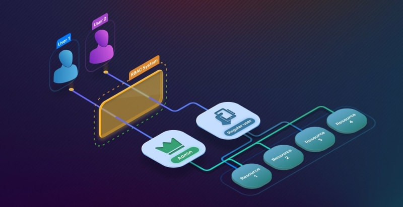

# cashin-node-access-control-api

## RBAC



### What is it?

Role-based access control (RBAC) restricts network access based on a person's role within an organization and has become one of the main methods for advanced access control. The roles in RBAC refer to the levels of access that employees have to the network.

Employees are only allowed to access the information necessary to effectively perform their job duties. Access can be based on several factors, such as authority, responsibility, and job competency. In addition, access to computer resources can be limited to specific tasks such as the ability to view, create, or modify a file.

As a result, lower-level employees usually do not have access to sensitive data if they do not need it to fulfill their responsibilities. This is especially helpful if you have many employees and use third-parties and contractors that make it difficult to closely monitor network access. Using RBAC will help in securing your company’s sensitive data and important applications.

## Installation

```bash
$ yarn install
```

## Running the app

```bash
# development
$ yarn run start

# watch mode
$ yarn run start:dev

# production mode
$ yarn run start:prod
```

## Test

```bash
# unit tests
$ yarn run test

# e2e tests
$ yarn run test:e2e

# test coverage
$ yarn run test:cov
```

## Support

[Digital guardian - Rbac](https://www.digitalguardian.com/blog/what-role-based-access-control-rbac-examples-benefits-and-more)
